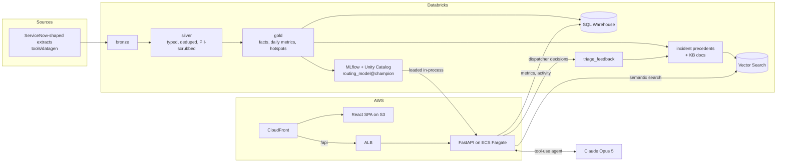

# Incident Intelligence Copilot

AI-assisted IT incident triage and analytics, built end to end: a Databricks Lakehouse pipeline, an ML routing model registered in Unity Catalog, semantic search with Databricks Vector Search, and a Claude agent that investigates new tickets and drafts cited resolutions for a dispatcher to approve. FastAPI and React on AWS, deployed by GitHub Actions.

**Live demo: https://d1fjhcqqwngd2n.cloudfront.net** (synthetic data for a fictional logistics company)

## Why
About a quarter of incidents at a typical enterprise service desk go to the wrong team first, and every reassignment adds hours to resolution. This app predicts the right team, shows how similar incidents were fixed, and drafts a resolution for a person to approve. It also shows IT leaders where incidents are spiking.

## Try it in two minutes
1. **Overview:** the weekly volume chart highlights planted outages (an email outage in January, a Chicago network outage in March, a VPN regression in May). Hover a bar for the breakdown.
2. **Triage → "Scanners down at Memphis":** the routing model and semantic search respond instantly: team, confidence, similar past incidents and their fixes, and KB articles.
3. **Draft with AI:** watch Claude call its tools live, then edit and approve the draft. Approved drafts become searchable precedents.
4. **Triage → "Vague: can't log in":** low model confidence triggers a review flag, and the agent asks the caller clarifying questions instead of guessing.
5. **Quality:** the agent's eval results, the before/after of an eval-driven prompt fix, and the routing benchmark against Claude.

## Results
| | |
|---|---|
| Routing accuracy on held-out months | **95.1%** vs 75.6% for today's first-time human routing |
| Trained model vs Claude zero-shot (same 200 tickets) | 95.5% vs 91.5% (Opus 5) / 87.0% (Haiku 4.5); 2 ms and ~$0 vs 1.8 s and $5.19 per 1k |
| Agent on 30 golden tickets | 100% right team and right KB on clear tickets, 0 ungrounded citations, questions asked on every vague ticket |
| Agent cost / latency | ~$0.06 and ~13 s per ticket, streamed live |

Details: [docs/architecture.md](docs/architecture.md) (routing benchmark, eval tables, observability queries).

## Architecture


- **Pipeline:** Lakeflow declarative pipeline (Asset Bundle) with data-quality expectations and PII scrubbing; a refresh job rebuilds RAG sources and syncs the indexes.
- **Routing model:** TF-IDF + logistic regression, time-split evaluation, benchmarked against Claude, served in-process from the registry ([ADR 0002](docs/adr/0002-in-process-routing-model.md)).
- **Agent:** manual tool loop with read-only tools, structured output, citation grounding checks, SSE streaming, human approval, and per-client/daily cost caps ([ADR 0004](docs/adr/0004-triage-agent-design.md)).
- **Quality:** unit tests across all components, deterministic agent evals with thresholds, and one structured telemetry record per agent run in CloudWatch.

Decision records: [docs/adr/](docs/adr/).

## Repo
| Path | What |
|---|---|
| `apps/api` | FastAPI backend, triage agent (`app/agent`), agent evals (`evals/`) |
| `apps/web` | React + TypeScript frontend |
| `tools/datagen` | Deterministic synthetic ServiceNow-shaped data generator |
| `pipelines` | Databricks Asset Bundle: medallion pipeline, RAG source tables, Vector Search sync job |
| `ml` | Routing model training, evaluation vs Claude, MLflow tracking, Unity Catalog registration |
| `infra/terraform` | AWS: ECS Fargate API behind an ALB, S3 + CloudFront, Secrets Manager, GitHub OIDC deploy role |
| `docs` | Architecture, decision records, AI workflow, demo script |

## Quick start
```bash
# 1. Generate data (writes to ./data/raw, git-ignored)
cd tools/datagen && uv run python -m datagen --out ../../data/raw

# 2. API (copy .env.example to .env: Databricks profile + warehouse ID, ANTHROPIC_API_KEY)
cd apps/api && uv sync && uv run uvicorn app.main:app --reload

# 3. Web
cd apps/web && npm install && npm run dev

# Agent evals (~$1.80 per full run)
cd apps/api && uv run python -m evals.run
```

## Deploy the Databricks side
Requires the [Databricks CLI](https://docs.databricks.com/dev-tools/cli/install.html), authenticated with `databricks auth login`.
```bash
cd pipelines
databricks bundle deploy
databricks fs cp -r ../data/raw/incidents   dbfs:/Volumes/workspace/incident_copilot/raw/incidents
databricks fs cp -r ../data/raw/kb_articles dbfs:/Volumes/workspace/incident_copilot/raw/kb_articles
databricks bundle run refresh_lakehouse      # pipeline -> RAG sources -> vector index sync

cd ../ml && uv run python -m routing.train --register   # trains and promotes routing_model@champion
```

## Deployment
Every push to `main` runs lint, type checks and tests for all components plus `terraform validate`. If everything passes, GitHub Actions:
1. assumes an AWS role through **OIDC** (no AWS keys in GitHub; only `main` of this exact repo, matched by immutable IDs, can assume it),
2. builds the API image, pushes it to ECR with an immutable tag, and rolls out a new ECS task definition (the circuit breaker rolls back if health checks fail),
3. builds the frontend, syncs it to S3, and invalidates CloudFront.

CloudFront serves the frontend and routes `/api/*` to the load balancer, so the browser sees one HTTPS origin; the load balancer only accepts CloudFront's IP ranges. The API reaches Databricks as a **least-privilege service principal**: read access to one schema, use of one warehouse, and write access to a single feedback table. Its OAuth secret and the Claude API key live in Secrets Manager and are injected at runtime; neither appears in code, CI, or Terraform state.

```bash
cd infra/terraform && terraform init && terraform plan   # infra changes are applied manually
```

## Built with AI coding tools
This project is developed with Claude Code. `CLAUDE.md` holds the project conventions the agent follows. Tests, type checks, CI and agent evals are the quality gate for all code, whether written by hand or by AI. See [docs/ai-workflow.md](docs/ai-workflow.md) for the working method and the problems verification caught along the way.
