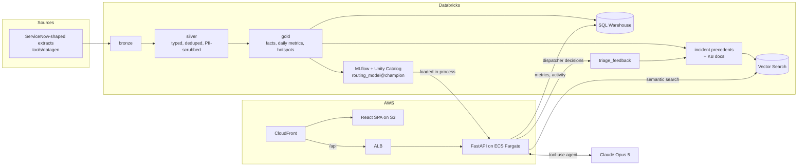

# Incident Intelligence Copilot

AI-assisted IT incident triage and analytics, built end to end: a Databricks Lakehouse pipeline, an ML routing model registered in Unity Catalog, semantic search with Databricks Vector Search, and a Claude agent that investigates new tickets and drafts cited resolutions for a dispatcher to approve. FastAPI and React on AWS, deployed by GitHub Actions.

**Live demo: https://d1fjhcqqwngd2n.cloudfront.net** (synthetic data for a fictional logistics company)

## Why
About a quarter of incidents at a typical enterprise service desk go to the wrong team first, and every reassignment adds hours to resolution. This app predicts the right team, shows how similar incidents were fixed, and drafts a resolution for a person to approve. It also shows IT leaders where incidents are spiking.

## Try it: the incident lifecycle in ten minutes
1. **Overview:** the weekly volume chart highlights planted outages (an email outage in January, a Chicago network outage in March, a VPN regression in May). Hover a bar for the breakdown.
2. **Get help → report a problem as an employee:** pick a persona (standing in for single sign-on), then describe it, for example "the label printer at outbound is printing blank labels". The virtual agent asks at most two questions and writes the ticket with its impact, urgency and priority. You review it and submit. The ticket gets a number, is routed on the spot (auto-assigned at ≥85% confidence), and appears in Incidents with a live SLA clock. Open it to add notes and resolve it.
3. **Triage → Review queue:** tickets the routing model wasn't sure about wait here for a dispatcher (try "everything is slow" on Get help). Below it, the sandbox takes any pasted text.
4. **Triage → "Scanners down at Memphis":** the routing model and semantic search respond instantly: team, confidence, similar past incidents and their fixes, and KB articles.
5. **Draft with AI:** watch Claude call its tools live, then edit and approve the draft. Approved drafts become searchable precedents.
6. **Triage → attach "VPN error dialog" → Read attachments with AI:** Claude reads the screenshot. It pulls out the exact error code and the "updated this morning" clue, then suggests a title and description. **Add to ticket & triage** routes the enriched ticket. The "Customer email (PDF)" sample shows sensitive data flagged but not copied.
7. **Triage → "Vague: can't log in":** low model confidence triggers a review flag, and the agent asks the caller clarifying questions instead of guessing.
8. **Incidents → any ticket** (try [INC0017396](https://d1fjhcqqwngd2n.cloudfront.net/#/incidents/INC0017396)): the lifecycle of one ticket. You get the work-note timeline, the SLA clock, and how often tickets like it breach. A routing check shows whether the model would have avoided the misroute, and Claude writes a handoff note or recap on demand. On [INC0018308](https://d1fjhcqqwngd2n.cloudfront.net/#/incidents/INC0018308), **Check knowledge base** finds that the closest article misses this fix and drafts a revision for you to approve. Approved articles flow back into the search the triage agent uses.
9. **Major incidents → Chicago HQ network outage:** 85 tickets grouped into one incident, with the hourly arrival curve. **Draft review** writes the post-incident review.
10. **Problems → VPN connection failures:** six weeks of elevated VPN tickets with no single outage behind them. One fix explains 100% of the surge against 34% normally. **Draft problem record** proposes the root cause, a workaround and the permanent fix. Compare with the weak-evidence WAN candidate, where the draft says so.
11. **Quality:** the agent's eval results, the before/after of an eval-driven prompt fix, and the routing benchmark against Claude.

## Results
| | |
|---|---|
| Routing accuracy on held-out months | **95.1%** vs 75.6% for today's first-time human routing |
| Trained model vs Claude zero-shot (same 200 tickets) | 95.5% vs 91.5% (Opus 5) / 87.0% (Haiku 4.5); 2 ms and ~$0 vs 1.8 s and $5.19 per 1k |
| Agent on 30 golden tickets | 100% right team and right KB on clear tickets, 0 ungrounded citations, questions asked on every vague ticket |
| Agent cost / latency | ~$0.06 and ~13 s per ticket, streamed live |
| Why routing matters | P1/P2 tickets misrouted first breached their SLA **70%** of the time vs 11% when routed right |
| SLA risk | Smoothed historical lookup beat a trained classifier on urgent tickets (AUC 0.69 vs 0.62), so the lookup ships ([ADR 0005](docs/adr/0005-sla-risk-lookup-over-classifier.md)) |
| Major-incident detection | All 4 planted outages found, ticket membership precision ≥0.99 and recall 1.00 against ground truth ([ADR 0007](docs/adr/0007-major-incidents-and-problems.md)) |
| Problem detection | Planted 6-week VPN client regression found with strong evidence (top fix 100% of surge vs 34% usually) |

Details: [docs/architecture.md](docs/architecture.md) (routing benchmark, eval tables, observability queries).

## Architecture


- **Pipeline:** Lakeflow declarative pipeline (Asset Bundle) with data-quality expectations and PII scrubbing; a refresh job rebuilds RAG sources, syncs the indexes, and derives the major-incident and problem tables.
- **Routing model:** TF-IDF + logistic regression, time-split evaluation, benchmarked against Claude, served in-process from the registry ([ADR 0002](docs/adr/0002-in-process-routing-model.md)).
- **Conversational intake and live tickets:** an employee chats with the virtual agent. It asks at most two questions, proposes the ticket, and the ticket is written to a Delta `tickets` table and triaged on creation: auto-assigned when the routing model is confident, otherwise queued for a dispatcher. A view unions live tickets with history, so every page and AI feature works on both ([ADR 0009](docs/adr/0009-conversational-intake-and-live-tickets.md)).
- **Attachment intake:** screenshots and PDFs are read into structured, reviewable facts (error text, device, site, scope). Files are type-checked by content and never stored ([ADR 0008](docs/adr/0008-attachment-intake.md)).
- **Lifecycle:** incident queue and ticket pages over the gold tables, with a work-note timeline, SLA clock, breach history, routing check and a cached one-call Claude summary.
- **Major incidents and problems:** SQL in the refresh job groups outage tickets into major incidents and finds sustained surges as problem candidates, graded by how much one fix explains them. Claude drafts the post-incident review and the problem record on demand.
- **Knowledge loop:** a resolved ticket's fix is checked against the closest KB articles. Claude says it is already documented, or drafts a revision or a new article, with a grounding check on the article it names. Approved drafts are merged into the KB index by the refresh job ([ADR 0006](docs/adr/0006-knowledge-loop.md)).
- **Agent:** manual tool loop with read-only tools, structured output, citation grounding checks, SSE streaming, human approval, and per-client/daily cost caps ([ADR 0004](docs/adr/0004-triage-agent-design.md)).
- **Quality:** unit tests across all components, deterministic agent evals with thresholds, and one structured telemetry record per agent run in CloudWatch.

Decision records: [docs/adr/](docs/adr/).

## Repo
| Path | What |
|---|---|
| `apps/api` | FastAPI backend, triage agent (`app/agent`), agent evals (`evals/`) |
| `apps/web` | React + TypeScript frontend |
| `tools/datagen` | Deterministic synthetic ServiceNow-shaped data generator |
| `pipelines` | Databricks Asset Bundle: medallion pipeline, RAG source tables, Vector Search sync, major-incident and problem detection |
| `ml` | Routing model training, evaluation vs Claude, MLflow tracking, Unity Catalog registration; SLA-risk estimator comparison |
| `infra/terraform` | AWS: ECS Fargate API behind an ALB, S3 + CloudFront, Secrets Manager, GitHub OIDC deploy role |
| `docs` | Architecture, decision records, AI workflow, demo script |

## Quick start
```bash
# 1. Generate data (writes to ./data/raw, git-ignored)
cd tools/datagen && uv run python -m datagen --out ../../data/raw

# 2. API (copy .env.example to .env: Databricks profile + warehouse ID, ANTHROPIC_API_KEY)
cd apps/api && uv sync && uv run uvicorn app.main:app --reload

# 3. Web
cd apps/web && npm install && npm run dev

# Agent evals (~$1.80 per full run)
cd apps/api && uv run python -m evals.run
```

## Deploy the Databricks side
Requires the [Databricks CLI](https://docs.databricks.com/dev-tools/cli/install.html), authenticated with `databricks auth login`.
```bash
cd pipelines
databricks bundle deploy
databricks fs cp -r ../data/raw/incidents   dbfs:/Volumes/workspace/incident_copilot/raw/incidents
databricks fs cp -r ../data/raw/kb_articles dbfs:/Volumes/workspace/incident_copilot/raw/kb_articles
databricks bundle run refresh_lakehouse      # pipeline -> RAG sources -> vector index sync

cd ../ml && uv run python -m routing.train --register   # trains and promotes routing_model@champion
```

## Deployment
Every push to `main` runs lint, type checks and tests for all components plus `terraform validate`. If everything passes, GitHub Actions:
1. assumes an AWS role through **OIDC** (no AWS keys in GitHub; only `main` of this exact repo, matched by immutable IDs, can assume it),
2. builds the API image, pushes it to ECR with an immutable tag, and rolls out a new ECS task definition (the circuit breaker rolls back if health checks fail),
3. builds the frontend, syncs it to S3, and invalidates CloudFront.

CloudFront serves the frontend and routes `/api/*` to the load balancer, so the browser sees one HTTPS origin; the load balancer only accepts CloudFront's IP ranges. The API reaches Databricks as a **least-privilege service principal**: read access to one schema, use of one warehouse, and write access to three tables: live tickets, dispatcher feedback and knowledge-draft decisions. Its OAuth secret and the Claude API key live in Secrets Manager and are injected at runtime; neither appears in code, CI, or Terraform state.

```bash
cd infra/terraform && terraform init && terraform plan   # infra changes are applied manually
```

## Built with AI coding tools
This project is developed with Claude Code. `CLAUDE.md` holds the project conventions the agent follows. Tests, type checks, CI and agent evals are the quality gate for all code, whether written by hand or by AI. See [docs/ai-workflow.md](docs/ai-workflow.md) for the working method and the problems verification caught along the way.
